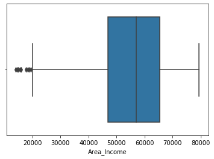
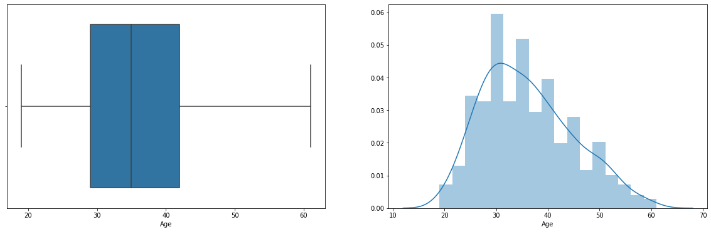
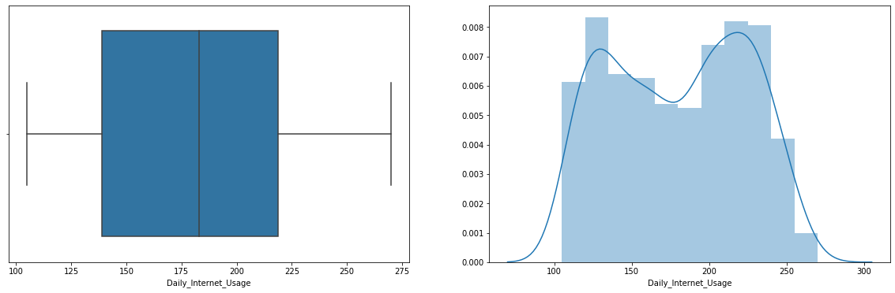
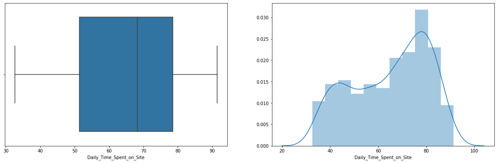
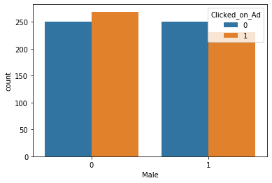
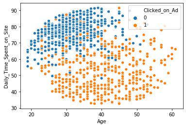
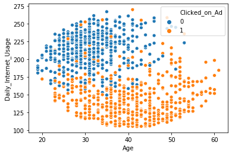
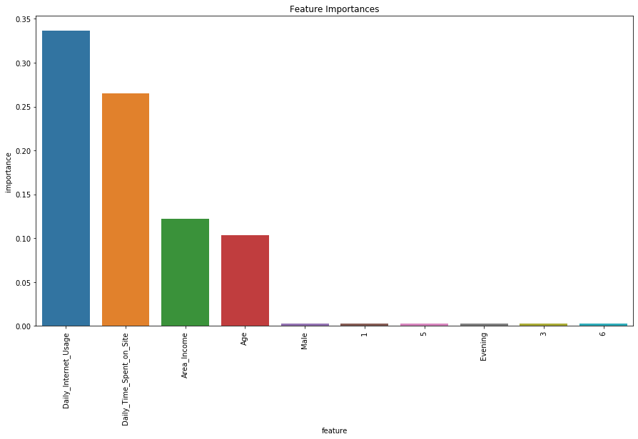

# Ad-Clicks

### **Project Definition**  
Predict who is more likely to click on the ad.  

### **Features in the Dataset**  

- Age  
- Area Income  
- Daily Internet Usage  
- Ad Topic Line  
- City  
- Male  
- Country  
- Timestamp  
- Clicked on Ad (Target Variable)

## **Data Cleaning**

- Checked for outliers using box plot for all the numerical features. As seen in the box plot we see there are few outliers in Area Income in the lower quartile.

- Used IQR to find the range of outliers in the Area Income feature. 
- Found nine outliers, and was removed.

## **EDA**

From the above distribution plot we see that there people among the age range of 35 to 40

From the above two plots of internet usage and daily time spent on site we see there are two different groups in the dataset.

The Plot above shows that female click on the ad more than male.

The above two scatter plot show that people in the age range of 30 to 40 spend the most time in the site and are the ones whose average internet usage is more than the rest.

## **Model**
- Created dummy variables for all the categorical variables
- Labels was created for different Hour bins
The models selected to predict if a person would click on the ad or not was:
- Logistic Regression
- Random Forest Classifier

| Model	                    |Accuracy Score|
|---------------------------|:-----------:|
|Logistic Regression 	        | 94%	  |
|Random Forest Classifier 	  | 98% 	  |

The plot below shows the features that where important in predicting who is mostl likely to click on the ad.

